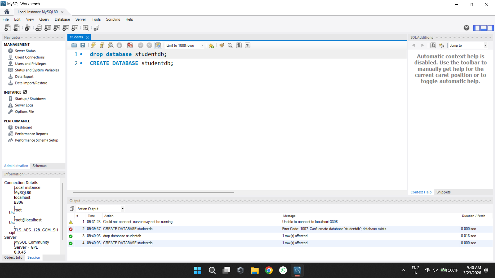
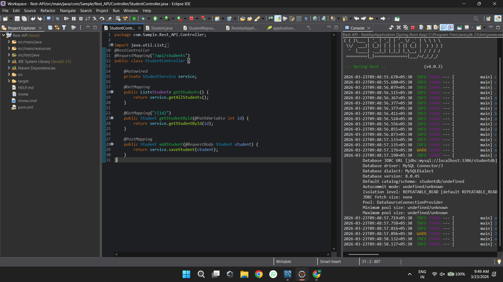
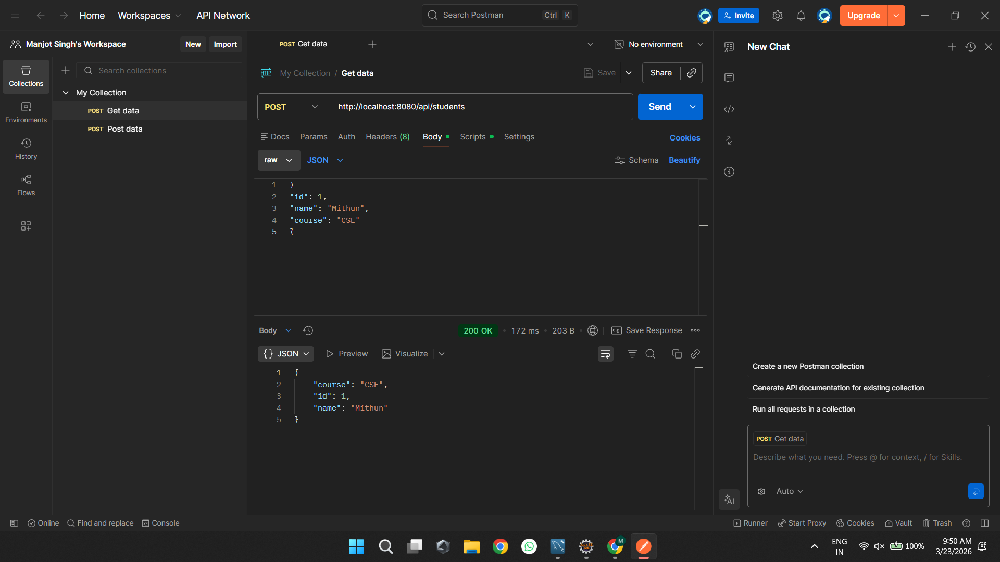
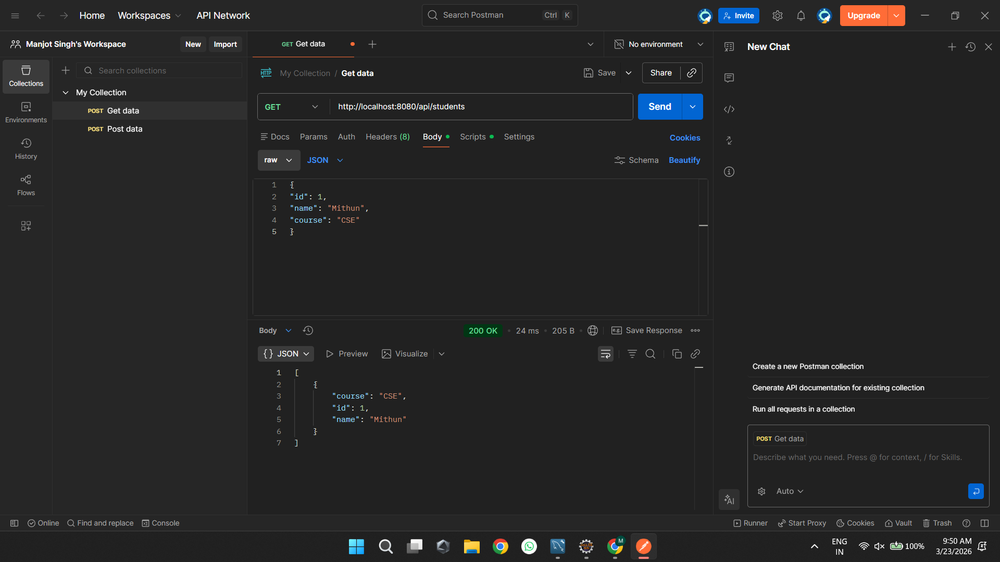
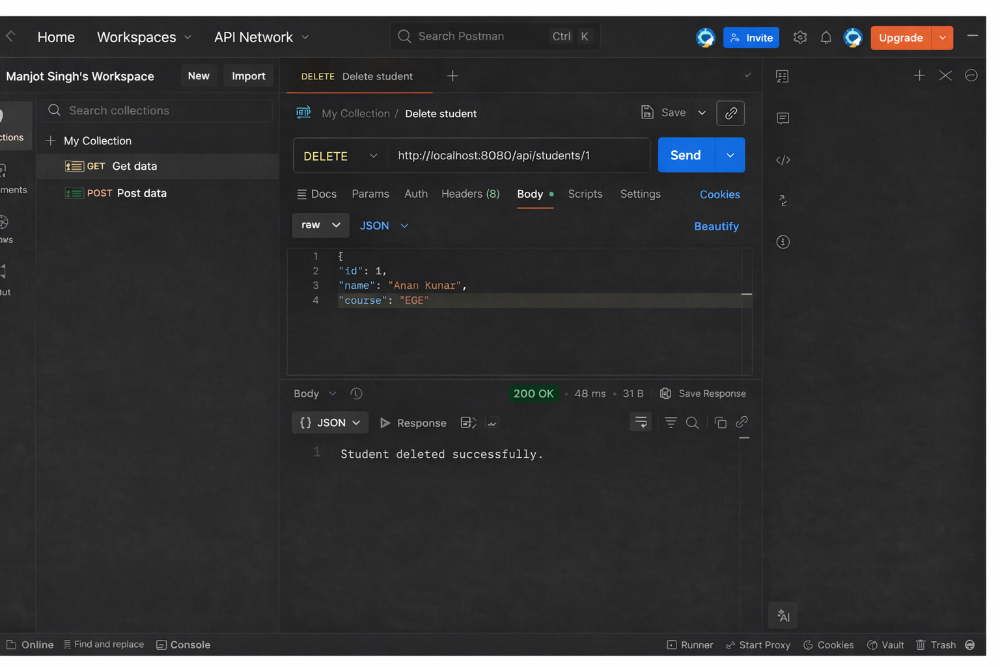

# Experiment 8: Developing a REST API with Spring Boot

This project demonstrates the complete development of a RESTful API that performs CRUD operations using Spring Boot. The application is connected to a MySQL database for data storage and has been tested using Postman.

---

## Objectives
- To understand the concepts of RESTful Web Services.
- To configure and set up a Spring Boot application using STS/Eclipse.
- To connect Spring Boot with a MySQL database using Spring Data JPA.
- To create API endpoints (GET, POST, PUT, DELETE) for handling JSON data.
- To test API endpoints using Postman.

---

## Technologies and Tools Used
- Language / Framework: Java, Spring Boot  
- IDE: Eclipse (Spring Tools Suite)  
- Database: MySQL Server  
- API Testing Tool: Postman  

---

## Implementation Steps and Execution Flow

### 1. Database Setup in MySQL
A database schema named `student` is created in MySQL along with the required tables. This database acts as the main storage system, and its structure corresponds to the Java entity classes.

---

### 2. Code Implementation in Eclipse
The project uses standard Spring Boot annotations:
- `@RestController` to handle HTTP requests  
- `@RequestMapping`, `@GetMapping`, `@PostMapping`, `@PutMapping`, `@DeleteMapping` for routing  
- `@Autowired` for dependency injection  

---

### 3. Running the Application
After configuring the `application.properties` file with database credentials and Hibernate settings, the main class is executed. Spring Boot starts an embedded Tomcat server (default port 8080) and connects to MySQL.

---

### 4. Testing API with POST Requests (Create)
Using Postman, a POST request is sent to an endpoint such as:
`http://localhost:8080/api/students`

A JSON payload is provided to insert new records into the database.

---

### 5. Verifying Data with GET Requests (Read)
GET requests are used to retrieve stored data and confirm that the API is working correctly and data is saved successfully.

---

### 6. Updating Data with PUT Requests (Update)
A PUT request is used to update existing records. For example:
`http://localhost:8080/api/students/{id}`

A JSON payload with updated values is sent, and the corresponding record is modified in the database.

---

### 7. Deleting Data with DELETE Requests (Delete)
A DELETE request is used to remove a record from the database. For example:
`http://localhost:8080/api/students/{id}`

The specified record is deleted permanently from the database.

---

## Key Takeaways
- Spring Initializr simplifies project setup and dependency management.  
- REST principles map HTTP methods (GET, POST, PUT, DELETE) to CRUD operations.  
- Spring Data JPA reduces the need for writing SQL queries.  
- Dependency Injection improves modularity and reduces boilerplate code.  
- Complete CRUD functionality ensures full control over database operations through APIs.  

---
